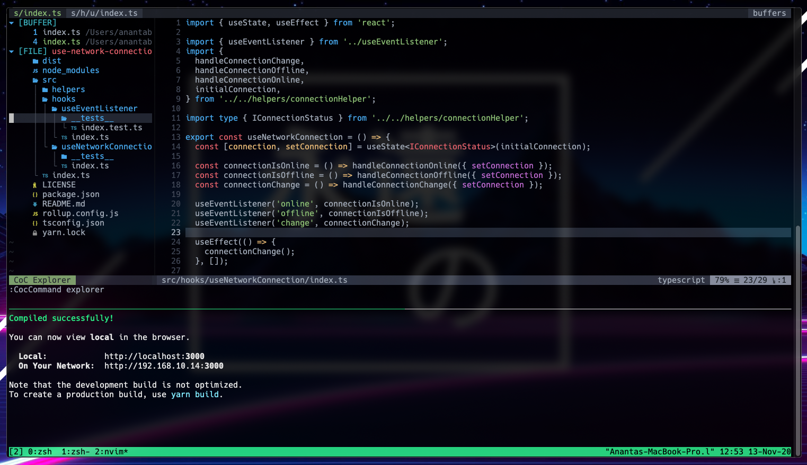

# Personal neovim config



## Install Neovim

- Mac

  ```
  brew install --HEAD neovim # Nightly version

  brew upgrade neovim --fetch-HEAD # Sometimes you need to update
  ```

## Clone this repo into your neovim config

```
git clone https://github.com/ananta/nvim.git ~/.config/nvim
```

## Install python & node support

```
pip install pynvim
```

```
npm i -g neovim
```
